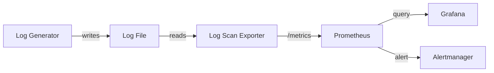

# ops-observability-lab

A local observability lab that turns operational log scanning into Prometheus metrics, Grafana dashboards, and Alertmanager alerts.

## Architecture

```text
log-generator
  writes simulated service logs
        |
        v
shared Docker volume: /app/sample-logs
        |
        v
log-exporter (:8000/metrics)
  scans recent log lines and exposes Prometheus metrics
        |
        v
Prometheus (:9090)
  scrapes metrics and evaluates alert rules
        |
        +--> Grafana (:3000)
        |     reads Prometheus and loads the provisioned dashboard
        |
        +--> Alertmanager (:9093)
              receives firing alerts from Prometheus
```





     
## Quick Start

```bash
git clone <repo-url>
cd ops-observability-lab
docker compose up --build
```

Open `http://localhost:3000` to view Grafana.

Open `http://localhost:9093` to view Alertmanager.

Prometheus is also available at `http://localhost:9090`, and the exporter metrics endpoint is available at `http://localhost:8000/metrics`.

## Components

`log-generator` simulates a running service by appending log lines to a shared Docker volume. The generated logs include normal messages, warnings, and error-like events such as database timeouts, deadlocks, and offline service messages.

`log_scan.py` is the reusable log scanning module. It finds log files, reads the most recent lines, handles common encodings, and counts configured keywords.

`log-exporter` wraps the scanner as a Prometheus exporter. It scans the shared log directory on a fixed interval and exposes the latest scan result on `/metrics`.

`Prometheus` scrapes the exporter every 15 seconds and evaluates the configured alert rules.

`Grafana` is provisioned with a Prometheus data source and a dashboard for the log scan metrics.

`Alertmanager` receives alerts from Prometheus and provides a local UI for checking alert state.

## Metrics Exposed

`logscan_scan_alerts{keyword="..."}`: number of matches for each configured keyword in the most recent scan.

`logscan_scan_alerts_total`: total number of keyword matches in the most recent scan.

`logscan_scan_lines_scanned`: number of log lines included in the most recent scan.

`logscan_scan_timestamp`: Unix timestamp for the most recent completed scan.

`logscan_scans_completed_total`: cumulative number of scan cycles completed by the exporter.

## Alert Rules

`LogErrorSpike`: fires when `increase(logscan_scan_alerts_total[5m]) > 5` for 1 minute. This indicates that the scanned log error count is rising quickly.

`ExporterDown`: fires when `up{job="log-exporter"} == 0` for 30 seconds. This indicates that Prometheus cannot scrape the log exporter.

## CI

GitHub Actions runs on pushes and pull requests to `main`.

The `lint-and-test` job checks out the repository, installs Python 3.11 dependencies, runs `flake8 --max-line-length=120 *.py`, and executes `python -m pytest tests/ -v`.

The `docker-build` job builds the project Docker image and validates the Docker Compose configuration with `docker compose config`.

## Background

This project is based on a practical operations on-call workflow: when a service behaves abnormally, engineers often start by checking recent logs for repeated error keywords, offline messages, deadlocks, and other failure signals. The lab turns that manual log investigation process into a small observability pipeline, so recent log findings can be scraped as metrics, displayed in Grafana, and routed through Alertmanager.
